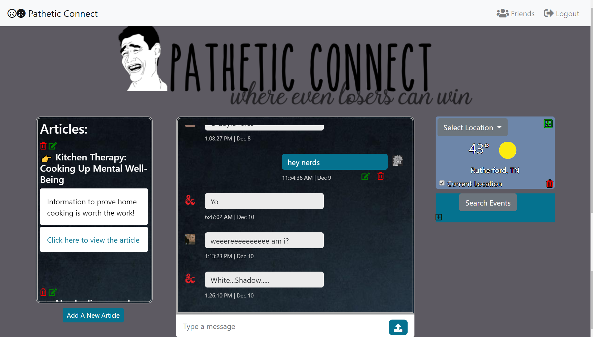

# nutshell
This project was a group effort to create a single web page application with multiple components. Each team member had to write all the code for one component. All of the components had to include complete CRUD on their data collections. The sections were broken out as such:

* Messages - Marco Crank
* Friends - Rich Fisher
* Articles - Michelle Beshears
* Events - Mary West
* Weather - Jasmine Walters

### How to run this app

* Once you have a clone of the project install the web dependencies in the terminal:
```sh
npm install
```
* Rename apiKeys.json.example file to apiKeys.json.
* Create a new project in Firebase and add your api keys to the apiKeys.json
* Create a free account at www.weatherbit.io and add the api code to the apiKeys.json file.
* Run the server in the terminal:
```sh
npm start
```

## Screenshots

### Homepage
